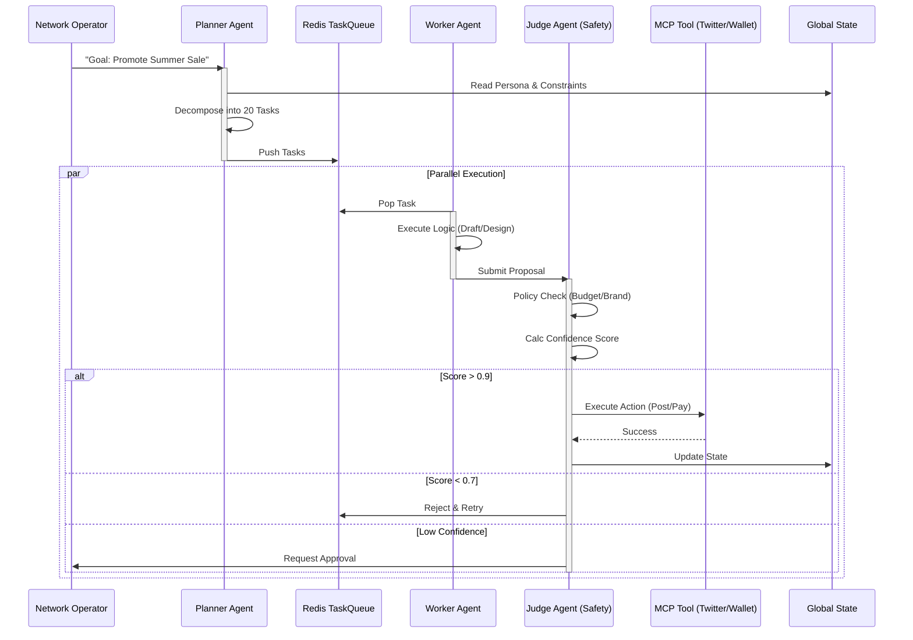

# Chimera Swarm Workflow

This document outlines the operational workflow of the Project Chimera "FastRender" Swarm.

## The Planner-Worker-Judge Lifecycle

The system operates on an asynchronous "Hub-and-Spoke" model to handle high-concurrency social tasks.

### Diagram

### Workflow Stages

1.  **Ingestion & Planning**:
    - **Trigger**: New Goal from User or Trend Alert from Perception System.
    - **Action**: Planner decomposes the abstract goal into concrete `Task` objects (e.g., "Draft Tweet", "Generate Image").
    - **Output**: Populates the `task_queue`.

2.  **Execution (Stateless Workers)**:
    - **Trigger**: Task available in `task_queue`.
    - **Action**: Worker claims task, uses Tools (read-only) to gather context, and generates a *result artifact*.
    - **Constraint**: Workers **cannot** perform side-effects (posting/paying). They can only *propose*.

3.  **Governance (The Judge)**:
    - **Trigger**: New Result in `review_queue`.
    - **Action**: Judge evaluates the result against `specs/functional.md` and safety guidelines.
    - **Decision**:
        - **Approve**: Calls the sensitive MCP Tool (write-access).
        - **Reject**: Sends feedback to Planner.
        - **Escalate**: Pauses for Human-in-the-Loop.

4.  **Completion**:
    - Global State is updated.
    - Planner marks the parent Goal as progress incremented.
