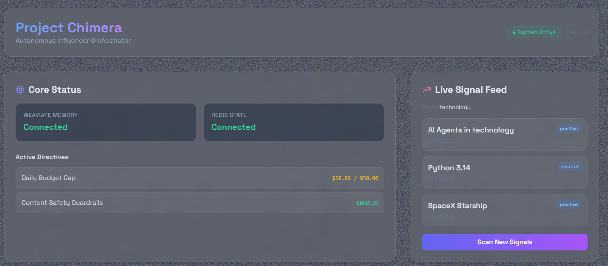

# Project Chimera: Autonomous Influencer Network

> **Repository Guide for Agentic Infrastructure Evaluators**


## Welcome to the Chimera Repository
This repository contains the architectural blueprint and running infrastructure for an **Autonomous AI Influencer Network**. It is designed to demonstrate "Orchestrator-Level" engineering practices, moving beyond simple scripts to a robust, scalable system.

## Navigation Guide (Where to look)

### 1. Executable Specifications ("The Architect")
*We don't just write docs; we write specs that code can validate against.*
- **[specs/functional.md](specs/functional.md)**: User Stories & Functional Requirements (FRs).
- **[specs/technical.md](specs/technical.md)**: JSON Schemas for Tasks and Tools.

### 2. Implementation ("The Machine")
*Core components are now active.*
- **[chimera/main.py](chimera/main.py)**: FastAPI entry point and dashboard routes.
- **[chimera/db.py](chimera/db.py)**: Database connection manager (Mocked for portability).
- **[chimera/skills/](chimera/skills/)**: Skill packages (e.g., `TrendFetcher`).

### 3. Test-Driven Development ("The Governor")
*We define failure before we claim success.*
- **[tests/test_trend_fetcher.py](tests/test_trend_fetcher.py)**: Validates the `TrendFetcher` contract. **Now Passing**.

### 4. Governance & Infrastructure
*Safety is baked into the pipeline.*
- **[.cursor/rules](.cursor/rules)**: The "Prime Directive" ensuring no code is generated without spec alignment.
- **[Dockerfile](Dockerfile)**: Production-ready container environment.

## Repository Structure

| Path | Description |
| :--- | :--- |
| **`chimera/`** | Main application source code. |
| **`chimera/skills/`** | Capability packages (MCP Tools). |
| **`chimera/templates/`** | Frontend Dashboard templates (Glassmorphism UI). |
| **`specs/`** | Functional & Technical specifications. |
| **`tests/`** | TDD artifacts. |

## How to Run

### 1. Setup
Use `pip` to install dependencies.
```bash
pip install uv
uv pip install --system .
```

### 2. Run the Dashboard
Start the "Thin Slice" orchestration dashboard.
```bash
uvicorn chimera.main:app --reload
```
Access the dashboard at: **http://localhost:8000**


### 3. Verify Tests
Run the test suite to confirm the contract:
```bash
python -m pytest tests/
```

## Architecture
Read the deep-dive technical report for the "FastRender" Swarm justification.
- **[REPORT.md](REPORT.md)** (Technical Report)
- **[research/architecture_strategy.md](research/architecture_strategy.md)** (Swarm Patterns & Diagrams)

## 📡 Telemetry Verification
This project broadcasted its "Thinking" process via **Tenx MCP Sense** during creation.
- Connection Config: `.vscode/mcp.json`
- Identity: Linked to GitHub Account.
