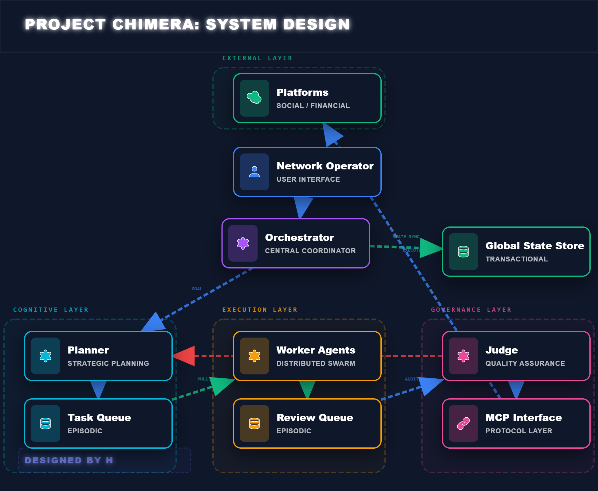
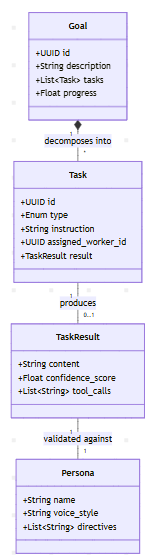

# Project Chimera: Submission Report

## 1. Research Summary & Strategic Insights

### The Paradigm Shift: Automation vs. Agency
We are witnessing a fundamental shift in AI deployment.
- **Automation** is rigid: "Post this tweet at 5 PM."
- **Agency** is goal-directed: "Grow my audience by 10%."
Our research into **OpenClaw** and **Agent Social Networks** reveals that true agency requires three components: **Identity** (Persona), **Connectivity** (MCP), and **Economy** (Wallets).

### Key Architectural Decisions

| Decision | Selected Option | Rejected Option | Justification |
| :--- | :--- | :--- | :--- |
| **Agent Pattern** | **Hierarchical Swarm** ("FastRender") | Monolithic Loop | A single loop blocks on every network call. A Swarm allows // parallel execution // of 50+ worker threads, essential for high-volume social engagement. |
| **Connectivity** | **Model Context Protocol (MCP)** | Direct API SDKs | Direct integration creates a "Maintenance Hell." MCP decouples the LLM from the API implementation, allowing us to swap Twitter for Threads without code changes. |
| **Governance** | **Optimistic Concurrency** | Gatekeeper Review | Reviewing *every* action destroys autonomy. We only check *before commit*, allowing high velocity with safety guarantees. |
| **Database** | **Polyglot Persistence** | Single SQL DB | An Agent's "Brain" is too complex for one DB. We need Vector for memories, SQL for ledgers, and Redis for queues. |

## 2. System Architecture

### The "FastRender" Swarm Pattern
The system creates a fractal organization of agents.

#### Logic Diagram: The Swarm Topology

### Data Strategy: Polyglot Persistence
We employ a "Right Tool for the Job" strategy for data storage.

| Component | Technology | Role & Justification |
| :--- | :--- | :--- |
| **Semantic Memory** | **Weaviate** | **The Soul.** Stores embeddings of past conversations and the "Persona." Allows the agent to use RAG to maintain character consistency over long timeframes. |
| **Transactional State** | **PostgreSQL** | **The Ledger.** Stores irrefutable data: User Accounts, Billing History, and completed Campaign Logs. Essential for "BoardKit" governance. |
| **Episodic State** | **Redis** | **The Nervous System.** High-speed storage for the Task Queue, Review Queue, and ensuring the "Planner" has a live view of the system state. |

## 3. Workflow & Governance

### The "Judge" Logic: Confidence-Based Governance
We implement a tiered safety system based on the LLM's self-reported confidence and policy checks.

| Confidence Score | Tier Name | Action Taken | Use Case Example |
| :--- | :--- | :--- | :--- |
| **0.90 - 1.00** | **High / Auto-Pilot** | **Execute Immediately** | Liking a comment, replying with generic thanks, checking crypto balance. |
| **0.70 - 0.89** | **Medium / Async** | **Queue for Human** | Drafting a partnership tweet, spending > $10. |
| **0.00 - 0.69** | **Low / Reject** | **Auto-Reject & Retry** | Hallucinated facts, violation of "Persona" constraints. |
| **Any Score** | **Critical / Sensitive** | **Mandatory ESCALATION** | Political topics, Hate speech filters, Wallet drain > 50%. |

### Sequence Diagram: The Life of a Task

## 4. Class Structure

This diagram explains the internal data models used to maintain state.

## 5. Conclusion
Project Chimera achieves the goal of an **Autonomous Influencer Network** not by making a smarter chatbot, but by building a smarter **system**.
- **Resilience**: The Swarm survives individual worker failures.
- **Safety**: The Judge ensures no hallucination reaches the public/blockchain.
- **Scalability**: MCP ensures we can add new platforms (TikTok, Farcaster) just by adding a new server, respecting the Open/Closed Principle.
