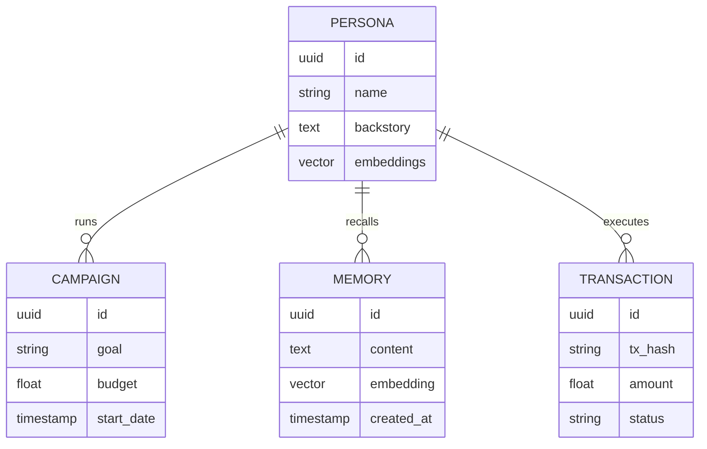

# Research & Architecture Strategy: Project Chimera

## 1. Analysis: Project Chimera & OpenClaw

### Fit within "Agent Social Network" (OpenClaw)
Project Chimera represents a specialized node type within the theoretical "OpenClaw" ecosystem—the **Influencer Node**.
- **Role**: Unlike purely service-based agents (e.g., "Coder Agent", "Data Scraper"), Chimera agents are **Identity-First** entities. Their primary value is *social capital* and *audience reach*, not just raw compute task execution.
- **Interaction**: In an OpenClaw network, a Chimera agent might contract a "Researcher Agent" to gather news data (Service Consumption) and then sell "Brand Awareness" to a "Marketing Agent" (Service Provision).
- **Economic Agency**: Using **Coinbase AgentKit**, these agents stop being passive tools and become active economic participants (Merchant/Service Provider) on the network.

### Required Social Protocols
To function effectively in a multi-agent society, Chimera requires specific protocols beyond standard HTTP/MCP:
1.  **Identity & Reputation Protocol**: A decentralized identifier (DID) linked to on-chain reputation. Other agents need to know: "Is this the *real* @LilMiquelaAI or a copycat?"
2.  **Service Discovery / Availability**: A standard way to broadcast "I am accepting sponsorship deals for the Fashion niche" (e.g., a standardized `agent-service.json` or on-chain registry).
3.  **Proof of Influence**: A cryptographic proof of audience reach (e.g., "Oracle verified 1M followers") to automate pricing for ad slots.
4.  **Transaction Protocol**: Standardized invoicing and settlement on Base (USDC/ETH), handled via AgentKit.

---

## 2. Domain Architecture Strategy

### Agent Pattern: Hierarchical Swarm ("FastRender")
We define a **Hierarchical Swarm** architecture (specifically the "FastRender" pattern) as the optimal choice, superior to a Sequential Chain or a Monolithic Loop.

#### Why Hierarchical Swarm?
- **Parallelism**: Social media management involves high-volume, low-latency tasks (replying to 50 comments). A sequential chain blocks; a swarm spins up 50 ephemeral "Worker" agents in parallel.
- **Resilience**: If one "Worker" hallucinates or fails, it defines a contained error blast radius. The "Planner" remains unaffected and can retry or adapt.
- **Specialization**: Separation of concerns allows for optimized models:
    - **Planner**: High-reasoning model (Gemini 1.5 Pro / Claude 3.5 Sonnet).
    - **Worker**: High-speed, cheaper model (Gemini Flash / GPT-4o-mini).
    - **Judge**: High-compliance, safety-tuned model.

```mermaid
graph TD
    User((Network Operator)) -->|Sets Goals| Orchestrator
    Orchestrator -->|Updates| GlobalState[Global State (Redis/Postgres)]
    
    subgraph "The Cognitive Core"
        Planner[Planner Agent] -->|Reads| GlobalState
        Planner -->|Decomposes| TaskQueue[Task Queue (Redis)]
    end
    
    subgraph "The Swarm"
        TaskQueue --> Worker1[Worker Agent]
        TaskQueue --> Worker2[Worker Agent]
        TaskQueue --> Worker3[Worker Agent]
        
        Worker1 -->|Execute Tool| MCP[MCP Interface]
        Worker2 -->|Execute Tool| MCP
        
        Worker1 -->|Result| ReviewQueue[Review Queue]
        Worker2 -->|Result| ReviewQueue
    end
    
    subgraph "Governance"
        ReviewQueue --> Judge[Judge Agent]
        Judge -->|Approve/Commit| GlobalState
        Judge -->|Reject/Retry| TaskQueue
        Judge -->|Low Confidence| HITL[Human-in-the-Loop]
    end
```

### Human-in-the-Loop (HITL): "Management by Exception"
We reject full automation in favor of **Optimistic Concurrency with Safety Gates**.
- **The "Judge" Pattern**: No content is published directly by a Worker. A specialized "Judge" agent acts as the gateway.
- **Confidence Scoring**:
    - **> 0.90 (High)**: Auto-publish.
    - **0.70 - 0.90 (Medium)**: Queue for async human review (does not block other tasks).
    - **< 0.70 (Low) or Sensitive**: Mandatory HITL or Auto-Reject.
- **Safety Layer**: All "Action" tools (Social Posting, Financial Transfer) are wrapped in governance middleware that checks limits (e.g., "Max $50/day") regardless of LLM intent.

### Database Strategy: Hybrid Polyglot Persistence
A single database cannot handle the diverse needs of an autonomous agent system.

| Data Type | Storage Solution | Justification |
| :--- | :--- | :--- |
| **Semantic Memory** | **Weaviate (Vector)** | Stores "Persona" (embedding-based retrieval), past interactions, and world knowledge. Allows fuzzy recall ("What did I say about shoes last month?"). |
| **Transactional State** | **PostgreSQL** | Rigid schema for User Accounts, Billing, Campaign Configuration, and Audit Logs. |
| **Episodic/Hot State** | **Redis** | High-velocity read/write for the "Global State" of the Swarm, Task Queues (Celery/BullMQ), and short-term conversation context. |


